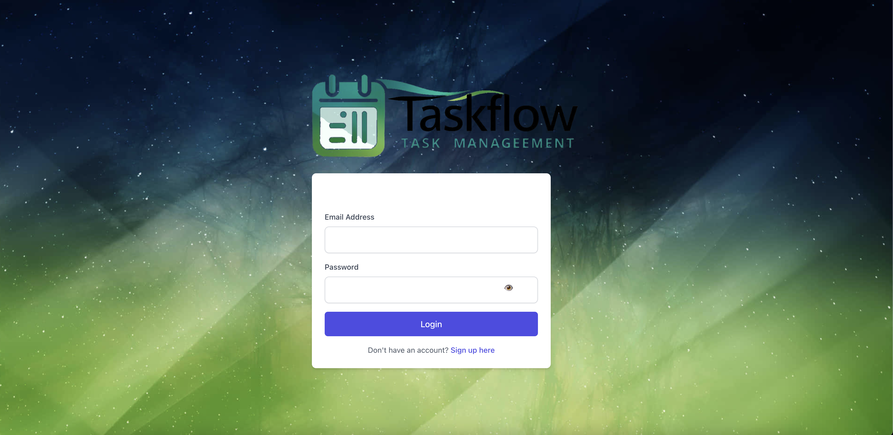

# TaskFlow  

TaskFlow offers a refreshingly simple approach to event tracking. In a world of overly complicated calendar apps, TaskFlow strips away the excess, providing a clean and intuitive interface for quickly logging your essential commitments.  

With TaskFlow, scheduling is as easy as selecting the day and naming the event—no more wrestling with intricate time settings or location details. This streamlined design makes it perfect for capturing events on the fly, ensuring you never forget a thing.  

While currently focused on core event logging, TaskFlow is built on a flexible foundation, poised for future expansion. We're actively exploring exciting new features, including reminders, location integration, and more granular time management—all while preserving the simplicity that makes TaskFlow so enjoyable to use.  

Join us now and experience the power of effortless event tracking, and be among the first to benefit from the exciting enhancements to come.  

## Preview



## 🚀 Features  
- **Minimalist Event Logging** – Quickly add events without hassle.  
- **User Authentication** – Secure access using JWT.  
- **Modern UI/UX** – Built with Tailwind CSS for a sleek and responsive experience.  
- **GraphQL API** – Efficient and flexible data handling.  
- **PostgreSQL Database** – Reliable data storage.  
- **Deployed with Railway** – Ensuring smooth and scalable hosting.  

## 🛠 Technologies Used  
- **Frontend**: React, Vite, Tailwind CSS, JavaScript, HTML, CSS  
- **Backend**: Node.js, Express, GraphQL, JWT Authentication  
- **Database**: PostgreSQL  
- **Deployment**: Railway  

## 📦 Installation & Setup  

1. **Clone the repository:**  
   ```sh
   git clone https://github.com/your-repo/taskflow.git
   cd taskflow
   ```  

2. **Install dependencies:**  
   ```sh
   npm install
   ```  

3. **Set up environment variables:**  
   Create a `.env` file in the root directory and configure the necessary variables (e.g., database URL, JWT secret).  

4. **Run the development server:**  
   ```sh
   npm run dev
   ```  
   The app should now be running at `http://localhost:3000`.  

5. **Start the backend server:**  
   ```sh
   npm run server
   ```  

## 👥 Contributors  
- **Liam Rayback**  
- **Fabricio Laboriel**  
- **Carlos Pastrana**  
- **Antonio Mata**  

## 📄 License  
This project is licensed under the [MIT License](LICENSE).
